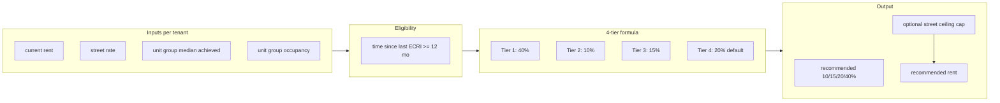

# Morningstar-Aligned ECRI Module Plan

## 1. Current State vs Morningstar: Core Differences

### Calculation model

| Dimension             | Current RevMan (Cory's concepts)                                                              | Morningstar (Brian's process)                                                                                                                                     |
| --------------------- | --------------------------------------------------------------------------------------------- | ----------------------------------------------------------------------------------------------------------------------------------------------------------------- |
| **Output**            | Continuum: recommended rent from gap capture (35%/55%/75% of gap to anchor)                   | **Four fixed percentages only:** 10%, 15%, 20%, 40%                                                                                                               |
| **Baseline**          | Position category → base stance (Aggressive/Baseline/Conservative) → gap capture              | **Start at 20%**; formula adjusts to 10, 15, or 40                                                                                                                |
| **Anchor**            | Street rate or market rate (configurable); gap to anchor drives increase                      | **Unit Group Median (achieved)** + **Street Rate**; no comp-weighted "market" in core formula                                                                     |
| **Evaluation**        | Current rent vs street/market                                                                 | **Forward-looking:** "New rate" (current × (1 + %)) vs unit group median and vs street                                                                            |
| **Unit group metric** | Average achieved rate per unit type                                                           | **Median** achieved rate (Brian builds via "median if" in Excel)                                                                                                  |
| **Formula inputs**    | Position category, then adjustment factors (occupancy, tenure, visits, multi-unit, rate hold) | **In formula:** unit group occupancy, tenant vs street %, new rate vs unit group median %. **Not in formula:** tenure, multi-unit (review-only; manual dial-down) |
| **Eligibility**       | Min tenure (e.g. 3 mo), min time between ECRIs (e.g. 6–12 mo), min gap to market              | **Time since last increase only** (e.g. April batch = everyone who had increase last April); 12 months between ECRIs                                              |

### Morningstar formula (from [brian-ecri-calculation-logic.md](revman/docs/brian-ecri-calculation-logic.md))

Evaluation order is strict (first match wins):

1. **Tier 1 → 40%:** New rate % delta to unit group median **&lt; -20%** AND unit group occupancy **&gt; 75%**
2. **Tier 2 → 10%:** New rate % delta to unit group median **&gt; 75%**
3. **Tier 3 → 15%:** Tenant vs street **&gt; 15%** AND New rate vs unit group median **&gt; 15%**
4. **Tier 4 → 20%:** Default (everyone else)

Where:

- **New rate** = current rent × (1 + proposed increase) — for the formula we evaluate using 20% as the "proposed" when checking tier 1/2/3 conditions (or iterate: apply tier logic to get the %).
- **Unit group median (achieved)** = median of current rents in same unit group.
- **Tenant vs street** = (current rent − street rate) / street rate.
- **% delta to median** = (rate − median) / median.

### What to keep (they said they value)

- **Metrics and context:** Brian said the factors we show are "really everything that we look at" ([revman-morningstar-brichardson-bdunworth-2-4-26.md](revman/docs/revman-morningstar-brichardson-bdunworth-2-4-26.md)); comp data is a "good addition" even though they don't pull it today.
- **Eligible list, cohort/risk grouping:** Narrow to eligible tenants; range (low/medium/high) and risk buckets for review.
- **History:** Prior ECRIs and tenant history; Brian wants historical tenant increase and comp history.
- **Override + reason:** DM/PM can change recommendation; require reason for modifications.
- **Send file / workflow:** Replace export → Excel → upload with in-platform workflow; DMs review and tweak.
- **Multi-unit + tenure on screen:** Not in formula but "we review as to help decide"; flag for manual review.
- **Occupancy + vacant count:** Bob: high occupancy ~80–90%; also number of vacant units (e.g. 90% or ≤2 vacant).
- **Facility/store overrides:** Some stores push harder; facility-level settings.
- **Post-lease-up / special unit groups:** Tag facilities or unit groups (e.g. first year off lease-up, RV parking) for different treatment (e.g. 50–90% first increase).
- **Cohort testing / move-out factor:** Track churn from notice through 30–45 days after effective; by market/store; inform future thresholds.
- **Non-storage units:** Visibility for retail/commercial/marina; exclude from ECRI flow.
- **Lexicon and definitions:** Bob sending definitions (achieved rate, etc.); align terminology.

### What to remove or replace (Cory's concepts)

- **Position categories** (BELOW_STREET, AT_STREET, ABOVE_STREET_BELOW_MARKET, etc.) as the driver of base stance — replace with Morningstar's tier logic.
- **Gap capture % (35/55/75)** and "anchor to street vs market" as the engine — replace with fixed 10/15/20/40% outputs.
- **Stance-based options** (Conservative/Baseline/Aggressive as three rent options) — replace with single recommended % (10/15/20/40) and optional manual override; optionally still show "what 10/15/20/40 would be" for override.
- **Eligibility:** Remove min tenure and min gap to market as hard gates; use **time since last ECRI** (e.g. 12 months) and calendar batch (e.g. "last increase April").
- **Adjustment factors** (visit frequency, rate hold, recent activity, tenure, multi-unit) as **formula inputs** — remove from formula; keep as **display/review flags** for manual dial-down.
- **Conflict resolution** (upgrade/downgrade, "most conservative wins") — not how Morningstar formulas work.
- **Cohort types** (LONG_TENURE, LARGE_GAP, POST_PROMO, HIGH_RISK) as derived from current engine — redefine for Morningstar (e.g. by tier, or by risk flags for review).
- **Market rate** (comp-weighted) as primary ECRI driver — keep for display/vacant pricing; not in Brian's core ECRI formula.

---

## 2. Vacant unit pricing (brief context)

- **Vacant pricing:** They do weekly "pricing"; market/comp data matters **more** for vacant than for ECRI ([morningstar--inital-interview-transcript.md](revman/docs/morningstar--inital-interview-transcript.md)).
- **ECRI:** Leans on **street rate** and **achieved (unit group)**; comps are secondary for ECRI.
- [VACANT_PRICING_LOGIC.md](revman/docs/VACANT_PRICING_LOGIC.md) describes seasonal demand, elasticity, optimal price — that stays as the vacant module backbone; no need to change that for this ECRI reframe.

---

## 3. Recommended first step: Knowledge consolidation + gap analysis

**Do this before writing code.** It gives you a single source of truth and a clear list of follow-ups for Brian/Justin.

### 3.1 Create a single “Morningstar ECRI spec” doc

- **Location:** e.g. `revman/docs/morningstar-ecri-spec.md` (or under `docs/ecri/`).
- **Contents:**
  - Terminology (unit group, unit group median achieved, street rate, tenant vs street, new rate, % delta).
  - Eligibility rule: time since last ECRI only (12 months); calendar batch (e.g. by last increase month).
  - Exact tier logic in order: Tier 1 (40%), Tier 2 (10%), Tier 3 (15%), Tier 4 (20%) with conditions from [brian-ecri-calculation-logic.md](revman/docs/brian-ecri-calculation-logic.md).
  - Definition of "unit group" (e.g. unit type at facility = size + climate + floor + access if they slice that way).
  - Use of **median** (not average) for achieved rate.
  - Forward-looking: how "new rate" is used in each tier (e.g. for Tier 1/2 we need a candidate % to compute new rate — document that we use 20% for the "would 20% put them here?" check, then assign 10/15/20/40).
  - Manual override cases: Street rate ceiling (40% → dial down); unit group risk; post-lease-up / special unit groups.
  - What is **not** in the formula: multi-unit, tenure (review only).

### 3.2 Document open questions and gaps

Turn the "Open Questions for Brian" from brian-ecri-calculation-logic.md into a concrete list, plus any new ones:

- **Tier 1:** Is 75% occupancy a hard cutoff or gradient? When 40% "strays too high" from street — cap at street? At street + X%?
- **Tier 2/3:** Exact comparison for "tenant vs street" and "new rate vs median" — is it (rate − ref) / ref, and which rate for "new rate" when determining tier (20% trial, or the tier’s own %)?
- **Unit group median:** Median of all occupied units in that unit group, or exclude the current tenant? (Usually "excluding self" for fairness.)
- **Eligibility:** Confirm: only "last increase date" (e.g. 330 days or 12 months), no minimum tenure or gap; how do they handle new acquisitions / out-of-cycle increases?
- **Post-lease-up / special:** How to tag (facility flag? unit group?); default first increase % (e.g. 80–90%) and any cap.
- **Excel Column Z:** If Brian can share a redacted copy or a few example rows with formula visible, we can validate our tier logic 1:1.

### 3.3 Optional but high-value: short follow-up with Brian/Justin

- Walk through the written spec (tier order, 20% baseline, forward-looking, median).
- Confirm eligibility (time since last ECRI only; batch by month).
- Clarify Street rate ceiling rule for Tier 1 (auto-cap at street vs manual-only).
- Confirm median is computed excluding current tenant (or not).
- Resolve one or two of the "open questions" above so the first build has high confidence.

---

## 4. Implementation structure (after knowledge step)

### 4.1 Option A: New “Morningstar” calculation path (recommended)

- Add a **second calculation mode** or **second engine** that implements only Morningstar logic:
  - **Inputs:** Per tenant: current rent, unit group median (achieved), unit group occupancy, street rate, unit group size (for "vacant count" display).
  - **Eligibility:** Time since last ECRI ≥ 12 months (and batch by last-increase month if we have that data).
  - **Core:** One function that returns 10, 15, 20, or 40 from the tier rules; optional Street rate ceiling (e.g. cap recommended % so new rent ≤ street, or street + X%).
  - **Output:** Recommended increase % (10/15/20/40), recommended rent, and which tier fired; no "three stances" or gap capture.
- Keep existing **UI and workflow** where possible:
  - Facility list, unit group / tenant list, history, override + reason, send-to-DM flow.
  - Replace "Conservative / Baseline / Aggressive" cards with "Recommended: X% ($Y)" and optional "Override %" or "Override $" with reason.
  - Still show: current rent, street rate, unit group median (achieved), unit group occupancy, tenant vs street %, new rate vs median %, and comps as context.
- **Data:** Use **median** achieved per unit group (add a small helper or DB view); keep passing achieved into the new engine. Keep market rate for display/vacant only.

### 4.2 Option B: Replace current engine entirely

- Same logic as Option A but remove the old position/stance/gap-capture engine and make Morningstar the only path. Cleaner long-term but bigger change; do after Option A is validated with Brian.

### 4.3 Files to touch (for Option A)

- **New:** `app/lib/morningstar-ecri-engine.ts` (or `ecri-morningstar.ts`) — tier logic only; no stance, no gap capture.
- **New or update:** `app/lib/ecri-eligibility.ts` — eligibility by "time since last ECRI" + optional batch month.
- **Update:** [app/lib/ecri-service.ts](revman/app/lib/ecri-service.ts) — compute **median** achieved per unit type; call Morningstar engine when company/facility is configured for "Morningstar" mode (or make it the default for a flag).
- **Update:** [app/lib/recommendation-engine.ts](revman/app/lib/recommendation-engine.ts) — either keep for "legacy" mode or deprecate once Morningstar is default.
- **Update:** [app/lib/types.ts](revman/app/lib/types.ts) — add types for Morningstar output (tier, recommended Pct 10|15|20|40); optional: keep existing types for backward compatibility during transition.
- **Settings:** Add company/facility setting for "ECRI model: Morningstar | Legacy" (or just switch default to Morningstar and hide legacy).
- **UI routes:** [app/routes/ecri/](revman/app/routes/ecri/) — show single recommended % and new rent; override with reason; keep history and cohort/risk grouping (redefined by tier or flags).

---

## 5. What “first step” means concretely

1. **Write** `revman/docs/morningstar-ecri-spec.md` (and optionally a one-page gap/open-questions doc).
2. **Decide** whether to do a short Brian/Justin follow-up to close the top 3–5 gaps.
3. **Then** implement the Morningstar engine and wire it into ecri-service and UI (Option A).
4. **Validate** with a few sample tenants (and, if possible, the Excel) so the module has a high degree of confidence that it matches how they work.

---

## 6. Summary diagram (Morningstar ECRI flow)

---

## 7. Risks and mitigations

- **Median vs average:** We currently use average achieved; Brian uses median. Switching to median per unit group is a small code + data change; document in spec.
- **Forward-looking tie-break:** For Tier 1 we need "new rate after 40%"; for Tier 2 "new rate after 10%". The doc describes evaluating "what would 20% give" first — we need one consistent rule (e.g. "evaluate with 20% to assign tier; then output that tier’s %"). Clarify in follow-up or spec.
- **Excel not readable:** We can’t read the xlsx; the written doc is the source. Getting 1–2 example rows from Brian (formula or result) would validate the implementation.

